## Part 1. Установка ОС

* Графический интерфейс должен отсутствовать.

Используем [Server install image for 64-bit PC (AMD64) computers (standard download)](https://releases.ubuntu.com/20.04/ubuntu-20.04.4-live-server-amd64.iso)

* Узнайте версию Ubuntu, выполнив команду cat /etc/issue.

Версия <br/> 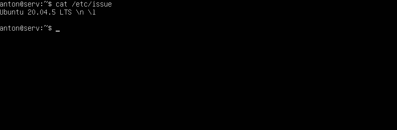

* Вставьте скриншот с выводом команды.


## Part 2. Создание пользователя

* Вставьте скриншот вызова команды для создания пользователя.

1. Добавление пользователя <br/> 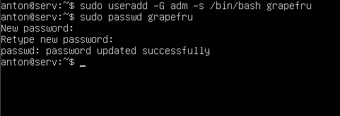

* Новый пользователь должен быть в выводе команды cat /etc/passwd

2. Файл passwd <br/> 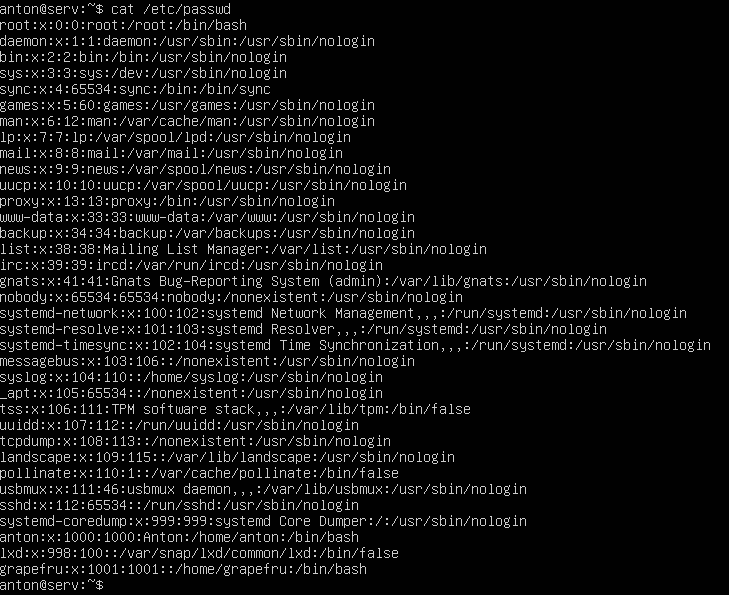

* Вставьте скриншот с выводом команды.


## Part 3. Настройка сети ОС

В отчёте опишите, что сделали для выполнения всех семи пунктов (можно как текстом, так и скриншотами).

* Задать название машины вида user-1

* Установить временную зону, соответствующую вашему текущему местоположению.

1. Временная зона <br/> 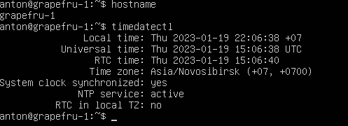

* Вывести названия сетевых интерфейсов с помощью консольной команды. В отчёте дать объяснение наличию интерфейса lo.

> Все TCP/IP реализации поддерживают loopback механизмы, которые реализуют виртуальный сетевой интерфейс исключительно программно и не связаны с каким-либо оборудованием, но при этом полностью интегрированы во внутреннюю сетевую инфраструктуру компьютерной системы. Любой трафик, который посылается компьютерной программой на интерфейс loopback, тут же получается тем же интерфейсом.
На системах Unix интерфейс loopback обычно имеет имя lo или lo0.
Интерфейс loopback имеет несколько путей применения. Он может быть использован сетевым клиентским программным обеспечением, чтобы общаться с серверным приложением, расположенным на том же компьютере.

2. Адресация <br/> 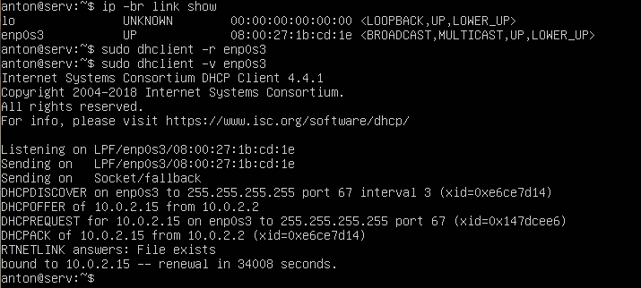

* Используя консольную команду получить ip адрес устройства, на котором вы работаете, от DHCP сервера. В отчёте дать расшифровку DHCP.

> **Dynamic Host Configuration Protocol** — протокол динамической настройки узла — прикладной протокол, позволяющий сетевым устройствам автоматически получать IP-адрес и другие параметры, необходимые для работы в сети TCP/IP.

* Определить и вывести на экран внешний ip-адрес шлюза (ip) и внутренний IP-адрес шлюза, он же ip-адрес по умолчанию (gw).

3. Шлюзы <br/> 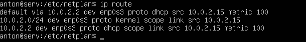

* Задать статичные (заданные вручную, а не полученные от DHCP сервера) настройки ip, gw, dns (использовать публичный DNS серверы, например 1.1.1.1 или 8.8.8.8).

4. Настройка сети (sudo vim /etc/netplan/00-installer-config.yaml) <br/> 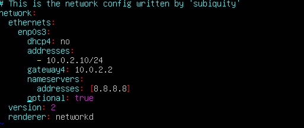

5. Проверка сети <br/> 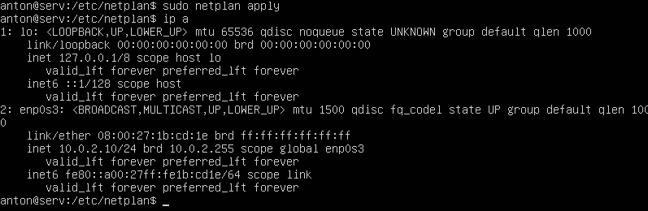

* Перезагрузить виртуальную машину. Убедиться, что статичные сетевые настройки (ip, gw, dns) соответствуют заданным в предыдущем пункте.

6. Проверка после перезагрузки <br/> 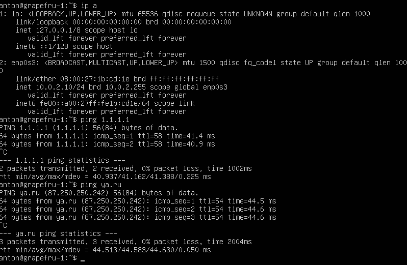

* Успешно пропинговать удаленные хосты 1.1.1.1 и ya.ru и вставить в отчёт скрин с выводом команды.

## Part 4. Обновление ОС

Обновить системные пакеты до последней на момент выполнения задания версии.

* После обновления системных пакетов, если ввести команду обновления повторно, должно появится сообщение, что обновления отсутствуют. Вставить скриншот с этим сообщением в отчёт.

Обновление <br/> 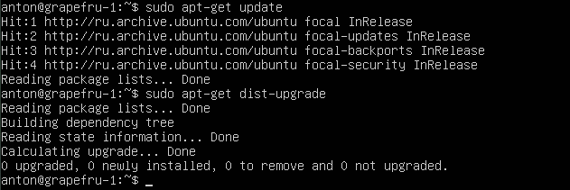

## Part 5. Использование команды sudo

Разрешить пользователю, созданному в Part 2, выполнять команду sudo.

```
$ sudo usermod -aG sudo loguser
$ su loguser
$ sudo nano /etc/hostname
```

* В отчёте объяснить истинное назначение команды sudo (про то, что это слово - "волшебное", писать не стоит).

> **sudo** (англ. Substitute User and do, дословно «подменить пользователя и выполнить») — программа для системного администрирования UNIX-систем, позволяющая делегировать те или иные привилегированные ресурсы пользователям с ведением протокола работы. Основная идея — дать пользователям как можно меньше прав, при этом достаточных для решения поставленных задач.

* Поменять hostname ОС от имени пользователя, созданного в пункте Part 2. (используя sudo).

Измененный hostname <br/> 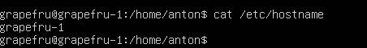

* Вставить скрин с изменённым hostname в отчёт.

## Part 6. Установка и настройка службы времени

Настроить службу автоматической синхронизации времени.

* Вывести время, часового пояса, в котором вы сейчас находитесь.
* Вывод следующей команды должен содержать NTPSynchronized=yes: timedatectl status

Время, часового пояса <br/> 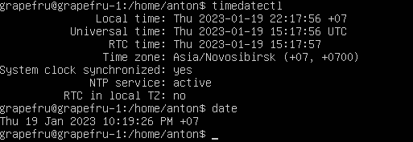

* Вставить скрины с корректным временем и выводом команды в отчёт.

## Part 7. Установка и использование текстовых редакторов

Установить текстовые редакторы VIM (+ любые два по желанию NANO, MCEDIT, JOE и т.д.)

Используя каждый из трех выбранных редакторов, создайте файл test_X.txt, где X -- название редактора, в котором создан файл. Напишите в нём свой никнейм, закройте файл с сохранением изменений.

В отчёт вставьте скриншоты:

* Из каждого редактора с содержимым файла перед закрытием.

1. VIM <br/> 

2. Nano <br/> 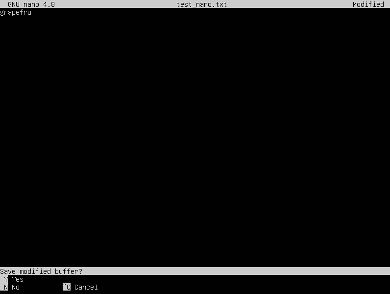

3. Ed <br/> 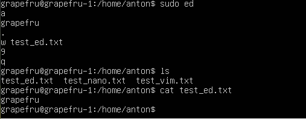

* В отчёте укажите, что сделали для выхода с сохранением изменений.
    * VIM: ESC :wq ENTER
    * Nano: ^X yes ENTER
    * Ed: w test_ed.txt ENTER q ENTER

Используя каждый из трех выбранных редакторов, откройте файл на редактирование, отредактируйте файл, заменив никнейм на строку "21 School 21", закройте файл без сохранения изменений.

В отчёт вставьте скриншоты:

* Из каждого редактора с содержимым файла после редактирования.

4. VIM <br/> 

5. Nano <br/> 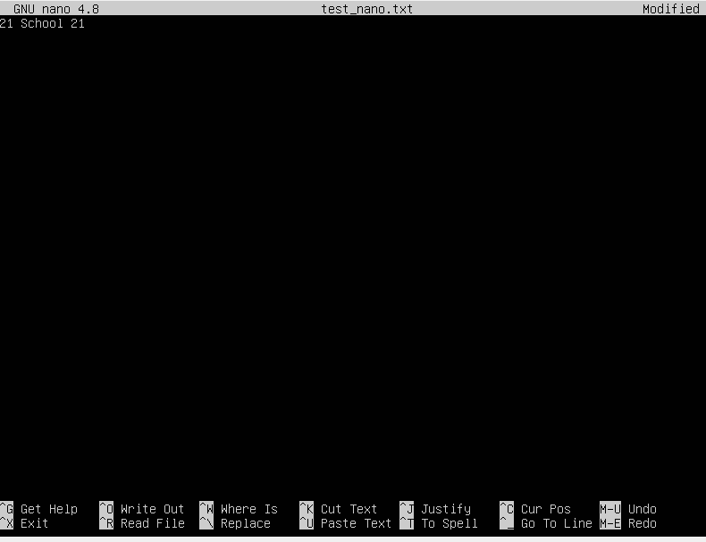

6. Ed <br/> 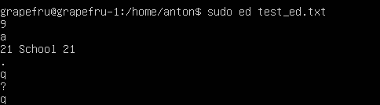

* В отчёте укажите, что сделали для выхода без сохранения изменений.
    * VIM: ESC :q! ENTER
    * Nano: ^X no ENTER
    * Ed: q ENTER

7. Файл не изменился <br/> 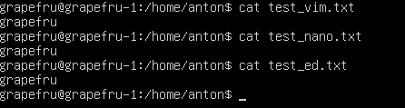

Используя каждый из трех выбранных редакторов, отредактируйте файл ещё раз (по аналогии с предыдущим пунктом), а затем освойте функции поиска по содержимому файла (слово) и замены слова на любое другое.

В отчёт вставьте скриншоты:

* Из каждого редактора с результатами поиска слова.

8. VIM <br/> 

9. Nano <br/> 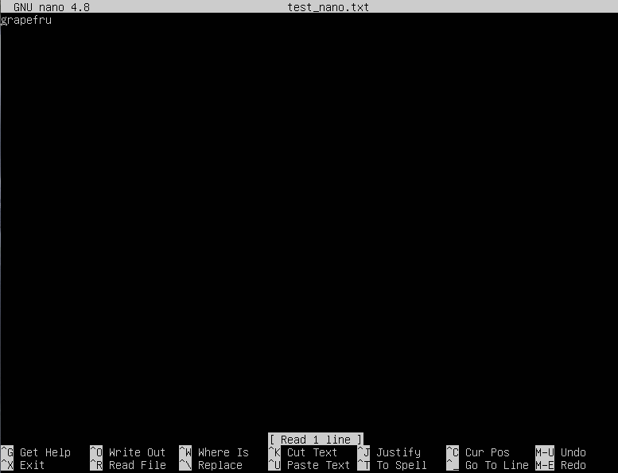

10. Ed <br/> 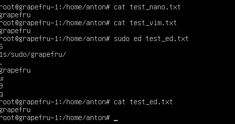

* Из каждого редактора с командами, введёнными для замены слова на другое.

    * VIM: ESC :s/sudo/grapefru/ ENTER
    * Nano: ^\ sudo ENTER grapefru ENTER
    * Ed: см. скриншот

## Part 8. Установка и базовая настройка сервиса SSHD

Установить службу SSHd.

Добавить автостарт службы при загрузке системы.

Перенастроить службу SSHd на порт 2022.

```
sudo apt install openssh-server
sudo vim /etc/ssh/sshd_config
# Port 22 раскомментировать и изменить на 2022
sudo systemctl enable ssh
sudo systemctl start sshd
```

Используя команду ps, показать наличие процесса sshd. Для этого к команде нужно подобрать ключи.

1. sshd <br/> 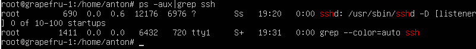

* В отчёте объяснить значение команды и каждого ключа в ней.

```
...
     -a - выбрать все процессы, кроме фоновых;
     -u, (U) - выбрать процессы пользователя.
     -x - перечисляет процессы без управляющего терминала. В основном это процессы, которые запускаются во время загрузки и работают в фоновом режиме.
```

Перезагрузить систему.

В отчёте опишите, что сделали для выполнения всех пяти пунктов (можно как текстом, так и скриншотами).
Вывод команды netstat -tan должен содержать `tcp 0 0 0.0.0.0:2022 0.0.0.0:* LISTEN` (если команды netstat нет, то ее нужно установить).
Скрин с выводом команды вставить в отчёт.

2. sshd <br/> 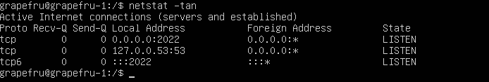

В отчёте объяснить значение ключей -tan, значение каждого столбца вывода, значение 0.0.0.0.

```
     netstat -- show network status
     -a    Показывать состояние всех сокетов; обычно сокеты, используемые серверными процессами, не показываются.
     -n    Показывать сетевые адреса как числа. netstat обычно показывает адреса как символы. Эту опцию можно использовать с любым форматом показа.
     -t    TCP
```

> 0.0.0.0 – это локальный адрес, зарезервированный серверами. То есть, при работе какого-либо сервера, тот может прописать эту комбинацию вместо любого IPv4-адреса, который принадлежит этой машине. Работает так же, как и локальная петля 127.0.0.1

## Part 9. Установка и использование утилит top, htop

Установить и запустить утилиты top и htop.

1. top <br/> 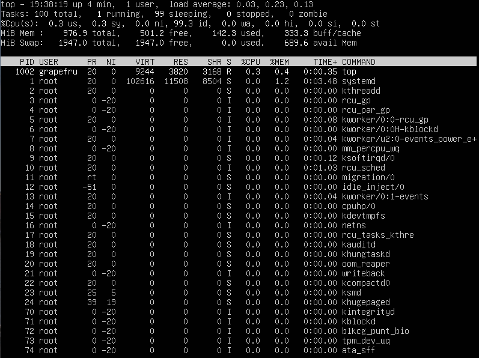

* По выводу команды top определить и написать в отчёте:

    + uptime - 4 min
    + количество авторизованных пользователей - 1
    + общую загрузку системы - 0.03, 0.23, 0.13
    + общее количество процессов - 100
    + загрузку cpu - 0.3
    + загрузку памяти - 142.3
    + pid процесса занимающего больше всего памяти - 1
    + pid процесса, занимающего больше всего процессорного времени - 1002

В отчёт вставить скрин с выводом команды htop:

* отсортированному по PID, PERCENT_CPU, PERCENT_MEM, TIME

2. PID <br/> 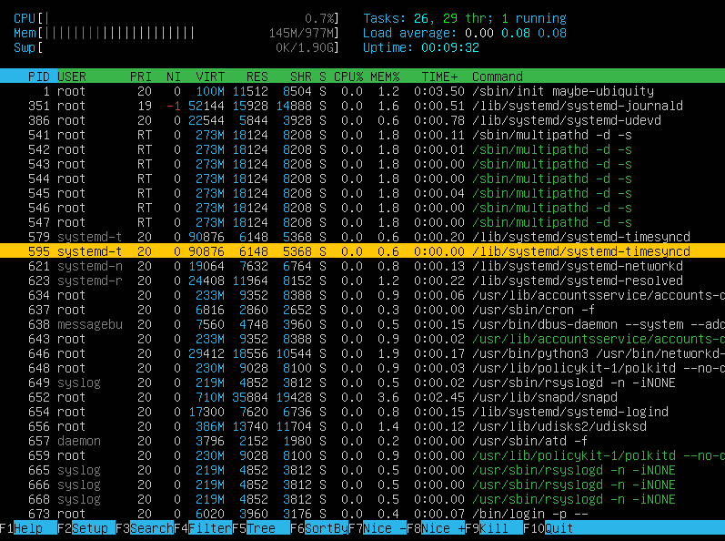

3. PERCENT_CPU <br/> 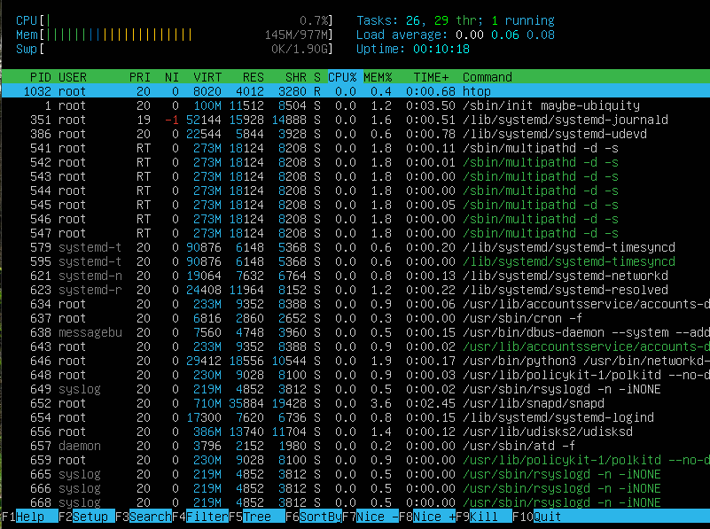

4. PERCENT_MEM <br/> 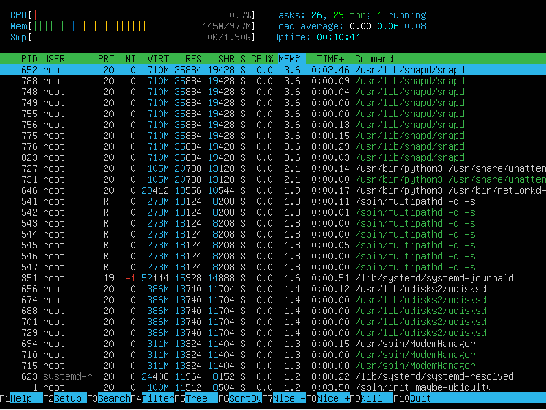

5. TIME <br/> 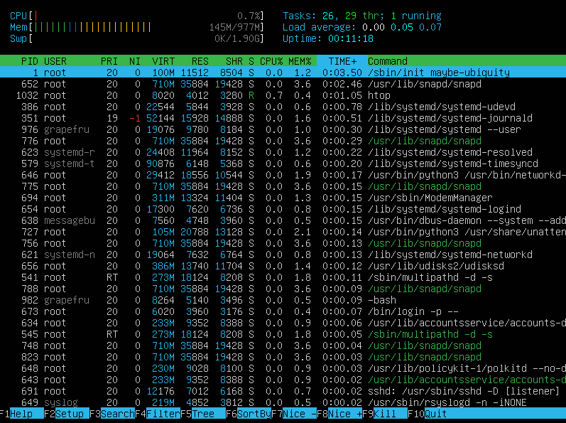

* отфильтрованному для процесса sshd

6. Фильтр sshd <br/> 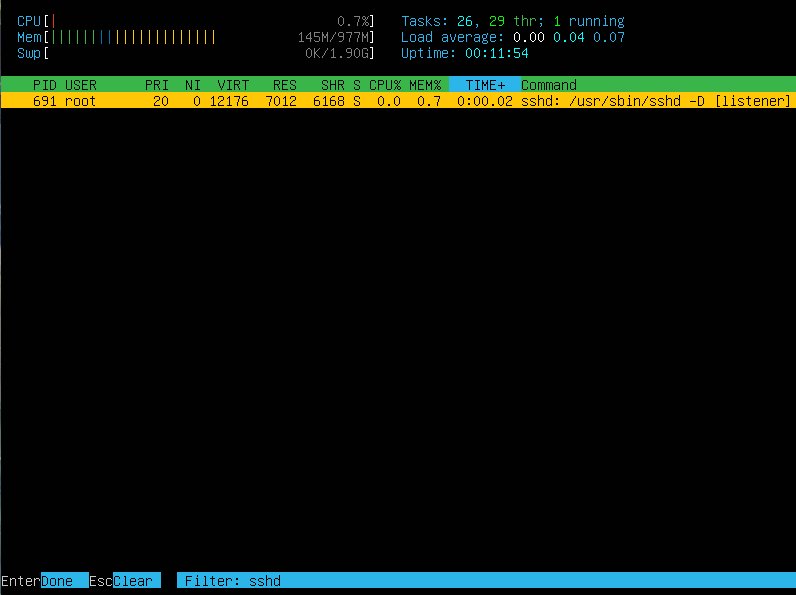

* с процессом syslog, найденным, используя поиск

7. Поиск syslog <br/> 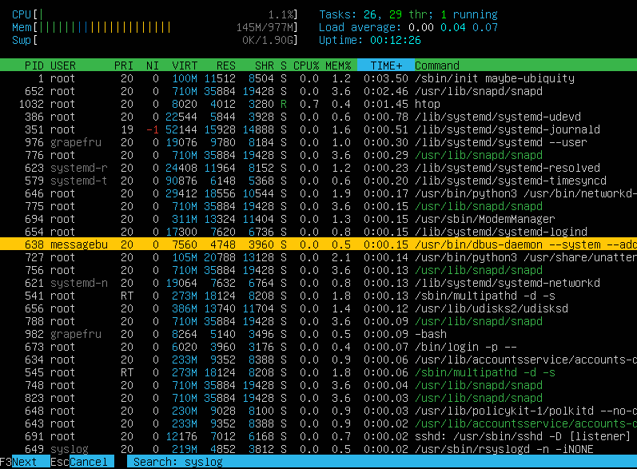

* с добавленным выводом hostname, clock и uptime

8. Добавленные поля <br/> 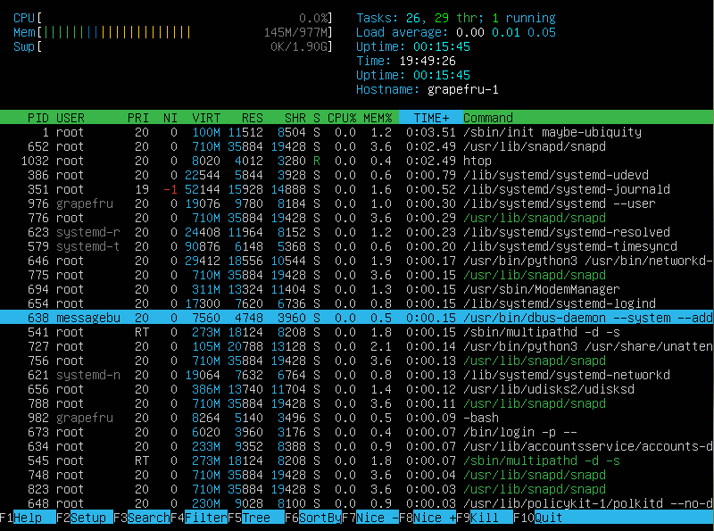

## Part 10. Использование утилиты fdisk

Запустить команду fdisk -l.

* В отчёте написать название жесткого диска, его размер 15.15 G и количество секторов - 31767760, а также размер swap - 1.9 G.

1. fdisk <br/> 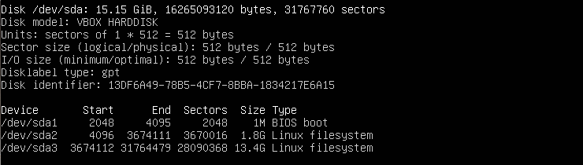

2. swap <br/> 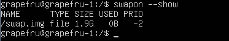

## Part 11. Использование утилиты df

Запустить команду df.

1. df <br/> 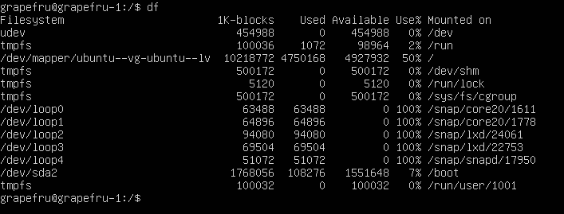

* В отчёте написать для корневого раздела (/):

    * размер раздела - 10218772
    * размер занятого пространства - 4750168
    * размер свободного пространства - 4927932
    * процент использования - 50 %

* Определить и написать в отчёт единицу измерения в выводе - байт.

Запустить команду df -Th.

2. df -Th <br/> 

* В отчёте написать для корневого раздела (/):

    * размер раздела - 9.8 G
    * размер занятого пространства - 4.6 G
    * размер свободного пространства - 4.7 G
    * процент использования - 50 %


## Part 12. Использование утилиты du

Запустить команду du.

Вывести размер папок /home, /var, /var/log (в байтах, в человекочитаемом виде)

1. Размер папок <br/> 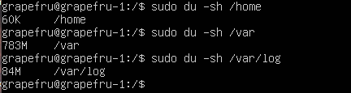

Вывести размер всего содержимого в /var/log (не общее, а каждого вложенного элемента, используя *)

2. Размер /var/log <br/> 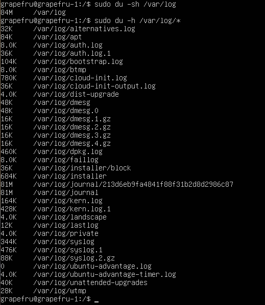

* В отчёт вставить скрины с выводом всех использованных команд.

## Part 13. Установка и использование утилиты ncdu

Установить утилиту ncdu.

Вывести размер папок /home, /var, /var/log.

1. Размер папок <br/> 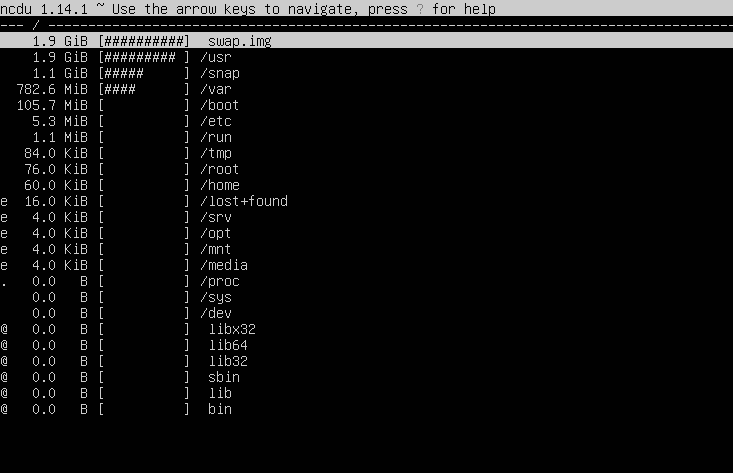

2. Размер /var/log <br/> 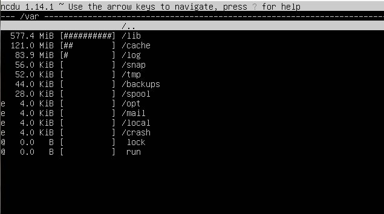

* Размеры должны примерно совпадать с полученными в Part 12.
* В отчёт вставить скрины с выводом использованных команд.

## Part 14. Работа с системными журналами

Открыть для просмотра:

1. /var/log/dmesg <br/> 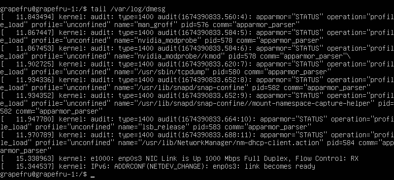

2. /var/log/syslog <br/> 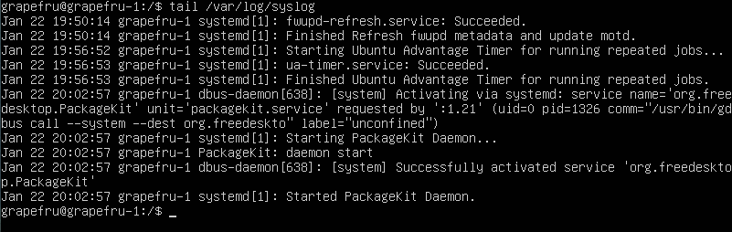

3. /var/log/auth.log <br/> 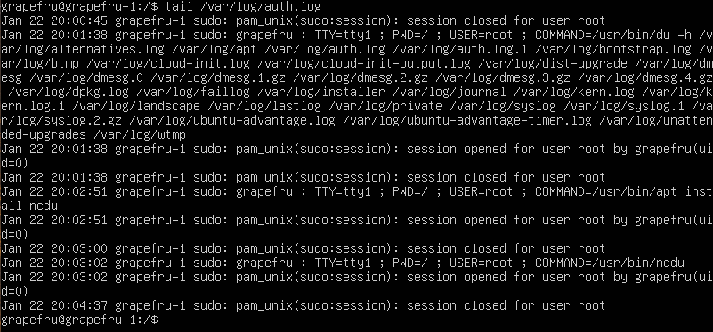

* Написать в отчёте время последней успешной авторизации, имя пользователя и метод входа в систему.

4. Время последней успешной авторизации <br/> 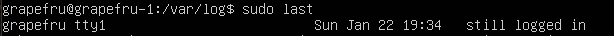

* Перезапустить службу SSHd. Вставить в отчёт скрин с сообщением о рестарте службы (искать в логах).

5. Рестарт службы <br/> 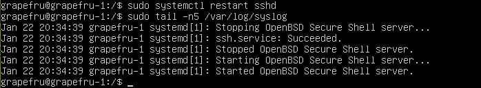

## Part 15. Использование планировщика заданий CRON

Используя планировщик заданий, запустите команду uptime через каждые 2 минуты.

* Найти в системных журналах строчки (минимум две в заданном временном диапазоне) о выполнении.
* Вывести на экран список текущих заданий для CRON.
* Вставить в отчёт скрины со строчками о выполнении и списком текущих задач.

Удалите все задания из планировщика заданий.

CRON <br/> 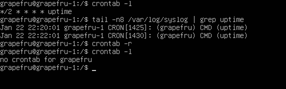

* В отчёт вставьте скрин со списком текущих заданий для CRON.