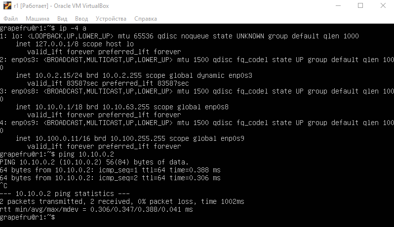
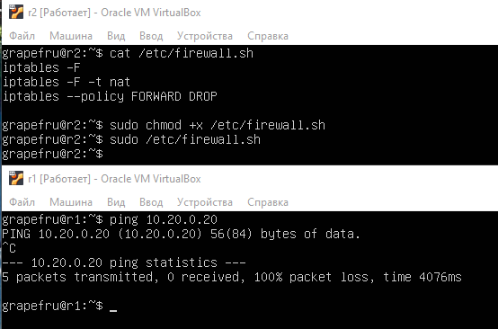

# Part 1. Инструмент ipcalc

Поднять виртуальную машину (далее -- ws1)

## 1.1. Сети и маски

Определить и записать в отчёт:

1. Адрес сети 192.167.38.54/13
```
192.160.0.0/13
```

2. Перевод маски 255.255.255.0 в префиксную и двоичную запись, /15 в обычную и двоичную, 11111111.11111111.11111111.11110000 в обычную и префиксную
```
/24
11111111.11111111.11111111.00000000
255.254.0.0
11111111.11111110.00000000.00000000
255.255.255.240
/28
```

3. Минимальный и максимальный хост в сети 12.167.38.4 при масках: /8, 11111111.11111111.00000000.00000000, 255.255.254.0 и /4
```
12.0.0.1 - 12.255.255.254
12.167.0.1 - 12.167.255.254
12.167.38.1 - 12.167.39.254
0.0.0.1 - 15.255.255.254
```

## 1.2. localhost

Определить и записать в отчёт, можно ли обратиться к приложению, работающему на localhost, со следующими IP: 194.34.23.100, 127.0.0.2, 127.1.0.1, 128.0.0.1
```
Адреса 127.0.0.0 - 127.255.255.255 так же зарезервированы для реализации механизма Loopback
127.0.0.2, 127.1.0.1 - сразу можно
194.34.23.100, 128.0.0.1 - сразу нельзя (но если настроить его адресом хоста, то можно)
```

## 1.3. Диапазоны и сегменты сетей

Определить и записать в отчёт:

1. какие из перечисленных IP можно использовать в качестве публичного, а какие только в качестве частных: 10.0.0.45, 134.43.0.2, 192.168.4.2, 172.20.250.4, 172.0.2.1, 192.172.0.1, 172.68.0.2, 172.16.255.255, 10.10.10.10, 192.169.168.1
```
10.0.0.45      - private
134.43.0.2     - public
192.168.4.2    - private
172.20.250.4   - public
172.0.2.1      - public
192.172.0.1    - public
172.68.0.2     - public
172.16.255.255 - private (broadcast)
10.10.10.10    - private
192.169.168.1  - public
```

2. какие из перечисленных IP адресов шлюза возможны у сети 10.10.0.0/18: 10.0.0.1, 10.10.0.2, 10.10.10.10, 10.10.100.1, 10.10.1.255
```
Диапазон узлов: 10.10.0.1 - 10.10.63.254
10.0.0.1    - нет
10.10.0.2   - да
10.10.10.10 - да
10.10.100.1 - нет
10.10.1.255 - да
```

## Part 2. Статическая маршрутизация между двумя машинами

Поднять две виртуальные машины (далее -- ws1 и ws2)

1. С помощью команды ip a посмотреть существующие сетевые интерфейсы. В отчёт поместить скрин с вызовом и выводом использованной команды.

Существующие сетевые интерфейсы <br/>  <br/> 

2. Описать сетевой интерфейс, соответствующий внутренней сети, на обеих машинах и задать следующие адреса и маски: ws1 - 192.168.100.10, маска /16, ws2 - 172.24.116.8, маска /12. В отчёт поместить скрины с содержанием изменённого файла etc/netplan/00-installer-config.yaml для каждой машины.

Настройка сети (sudo vim /etc/netplan/00-installer-config.yaml) <br/>  <br/> 

3. Выполнить команду netplan apply для перезапуска сервиса сети. В отчёт поместить скрин с вызовом и выводом использованной команды.

Выполнить команду netplan apply <br/>  <br/> 

## 2.1. Добавление статического маршрута вручную

1. Добавить статический маршрут от одной машины до другой и обратно при помощи команды вида ip r add. Пропинговать соединение между машинами. В отчёт поместить скрин с вызовом и выводом использованных команд.

Добавление статического маршрута <br/>  <br/> 

## 2.2. Добавление статического маршрута с сохранением

1. Перезапустить машины. Добавить статический маршрут от одной машины до другой с помощью файла etc/netplan/00-installer-config.yaml. В отчёт поместить скрин с содержанием изменённого файла etc/netplan/00-installer-config.yaml.

2. Пропинговать соединение между машинами. В отчёт поместить скрин с вызовом и выводом использованной команды.

Ping после перезапуска <br/>  <br/> 

# Part 3. Утилита iperf3

## 3.1. Скорость соединения

1. Перевести и записать в отчёт: 8 Mbps в MB/s, 100 MB/s в Kbps, 1 Gbps в Mbps

```
8 Mbps = 1 MB/s
100 MB/s = 800000 Kbps
1 Gbps = 1000 Mbps
```

## 3.2. Утилита iperf3

1. Измерить скорость соединения между ws1 и ws2. В отчёт поместить скрины с вызовом и выводом использованных команд.

Скорость соединения <br/> 

## Part 4. Сетевой экран

## 4.1. Утилита iptables

1. Создать файл /etc/firewall.sh, имитирующий фаерволл, на ws1 и ws2:

```
#!/bin/sh

# Удаление всех правил в таблице "filter" (по-умолчанию).
iptables –F
iptables -X
```

2. Нужно добавить в файл подряд следующие правила:

    1) на ws1 применить стратегию когда в начале пишется запрещающее правило, а в конце пишется разрешающее правило (это касается пунктов 4 и 5)

    2) на ws2 применить стратегию когда в начале пишется разрешающее правило, а в конце пишется запрещающее правило (это касается пунктов 4 и 5)

    3) открыть на машинах доступ для порта 22 (ssh) и порта 80 (http)

    4) запретить echo reply (машина не должна "пинговаться”, т.е. должна быть блокировка на OUTPUT)

    5) разрешить echo reply (машина должна "пинговаться")
    
```
iptables -P INPUT DROP # блокируем все соединения, кроме явно разрешенных

iptables -A INPUT -p tcp --dport 22 -m state --state NEW -j ACCEPT # разрешаем соединение с ssh портом
iptables -A INPUT -m state --state ESTABLISHED,RELATED -j ACCEPT # разрешаем все установленные и связанные соединения

iptables -A INPUT -p tcp --dport 80 -m state --state NEW -j ACCEPT # разрешаем соединение с ssh портом
iptables -A INPUT -m state --state ESTABLISHED,RELATED -j ACCEPT # разрешаем все установленные и связанные соединения

iptables -A OUTPUT -p icmp --icmp-type echo-request -j DROP # блокируем PING на сервере без каких-либо сообщений об ошибках
iptables -A INPUT -p icmp --icmp-type echo-reply -j DROP

iptables -A INPUT -p icmp --icmp-type echo-request -j ACCEPT # разрешаем прохождения ICMP пакетов с сервера и на него
iptables -A OUTPUT -p icmp --icmp-type echo-reply -j ACCEPT
```

В отчёт поместить скрины с содержанием файла /etc/firewall для каждой машины.

Содержание файлов /etc/firewall.sh <br/>  <br/> 

3. Запустить файлы на обеих машинах командами chmod +x /etc/firewall.sh и /etc/firewall.sh. В отчёт поместить скрины с запуском обоих файлов.

Запуск файлов <br/>  <br/> 

В отчёте описать разницу между стратегиями, применёнными в первом и втором файлах.
```
На хосте ws1 в цепочке OUTPUT (исходящие соединения) пакеты ответа на ping (icmp echo reply) будут отброшены с уведомлением отправителя.
Запросы icmp echo request разрешены (разрешено устанавливать исходящие соединения).
На хосте ws2 в цепочке OUTPUT (исходящие соединения) пакеты ответа на ping (icmp echo reply) разрешены, машина будет отвечать на пинг.
Отправка icmp запросов запрещена.
```

## 4.2. Утилита nmap

1. Командой ping найти машину, которая не "пингуется", после чего утилитой nmap показать, что хост машины запущен. Проверка: в выводе nmap должно быть сказано: Host is up. В отчёт поместить скрины с вызовом и выводом использованных команд ping и nmap.

PING <br/>  <br/>  

Запуск nmap <br/> 

# Part 5. Статическая маршрутизация сети

Поднять пять виртуальных машин (3 рабочие станции (ws11, ws21, ws22) и 2 роутера (r1, r2))

## 5.1. Настройка адресов машин

1. Настроить конфигурации машин в etc/netplan/00-installer-config.yaml согласно сети на рисунке. В отчёт поместить скрины с содержанием файла etc/netplan/00-installer-config.yaml для каждой машины.

Содержимое /etc/netplan/00-installer-config.yaml машин ws11 и r1 <br/>  <br/> 

Содержимое /etc/netplan/00-installer-config.yaml машин ws21, ws22 и r1 <br/>  <br/>  <br/> 

2.  Перезапустить сервис сети. Если ошибок нет, то командой ip -4 a проверить, что адрес машины задан верно. Также пропинговать ws22 с ws21. Аналогично пропинговать r1 с ws11. В отчёт поместить скрины с вызовом и выводом использованных команд.

Проверка адреса машин и пинга <br/>  <br/>  <br/>  <br/>  <br/> 

## 5.2. Включение переадресации IP-адресов.

1. Для включения переадресации IP, выполните команду на роутерах:
`sysctl -w net.ipv4.ip_forward=1`. При таком подходе переадресация не будет работать после перезагрузки системы. В отчёт поместить скрин с вызовом и выводом использованной команды.
Включение передраесации IP <br/> 

2. Откройте файл /etc/sysctl.conf и добавьте в него следующую строку: `net.ipv4.ip_forward = 1`. При использовании этого подхода, IP-переадресация включена на постоянной основе. В отчёт поместить скрин с содержанием изменённого файла /etc/sysctl.conf.

Включение переадресации на r1, r2 <br/>  <br/> 

## 5.3. Установка маршрута по-умолчанию

Пример вывода команды ip r после добавления шлюза:
```
default via 10.10.0.1 dev eth0
10.10.0.0/18 dev eth0 proto kernel scope link src 10.10.0.2
```
1. Настроить маршрут по-умолчанию (шлюз) для рабочих станций. Для этого добавить gateway4 [ip роутера] в файле конфигураций. В отчёт поместить скрин с содержанием файла etc/netplan/00-installer-config.yaml.

Добавление гейта для клиентских машин <br/>  <br/>  <br/> 

2.  Вызвать ip r и показать, что добавился маршрут в таблицу маршрутизации. В отчёт поместить скрин с вызовом и выводом использованной команды.

Маршруты по умолчанию <br/> 

3. Пропинговать с ws11 роутер r2 и показать на r2, что пинг доходит. Для этого использовать команду: `tcpdump -tn -i eth1`. В отчёт поместить скрин с вызовом и выводом использованных команд.

Маршруты по умолчанию для роутеров <br/>  <br/> 

Пинг c ws11 до r2 <br/> 

## 5.4. Добавление статических маршрутов

1. Добавить в роутеры r1 и r2 статические маршруты в файле конфигураций. Пример для r1 маршрута в сетку 10.20.0.0/26:
```
# Добавить в конец описания сетевого интерфейса eth1:
- to: 10.20.0.0
  via: 10.100.0.12
```
В отчёт поместить скрины с содержанием изменённого файла etc/netplan/00-installer-config.yaml для каждого роутера.

Cодержание файла /etc/netplan/00-installer-config.yaml на роутерах <br/>  <br/> 

2. Вызвать ip r и показать таблицы с маршрутами на обоих роутерах. Пример таблицы на r1:
```
10.100.0.0/16 dev eth1 proto kernel scope link src 10.100.0.11
10.20.0.0/26 via 10.100.0.12 dev eth1
10.10.0.0/18 dev eth0 proto kernel scope link src 10.10.0.1
```
В отчёт поместить скрин с вызовом и выводом использованной команды.

Маршруты на роутерах <br/> 

3. Запустить команды на ws11: `ip r list 10.10.0.0/[маска сети] и ip r list 0.0.0.0/0`. В отчёт поместить скрин с вызовом и выводом использованных команд. В отчёте объяснить, почему для адреса 10.10.0.0/[порт сети] был выбран маршрут, отличный от 0.0.0.0/0, хотя он попадает под маршрут по-умолчанию.

Маршруты на ws11 <br/> 

```
В таблице маршрутизации более конкретный адрес (с большей маской или точнее совпадающий) имеет больший приоритет. Например, для адреса 10.10.0.1 может сначала выбираться прямой адрес 10.10.0.1, затем маска 10.10.0.0/18, затем самый общий маршрут 0.0.0.0/0
```

## 5.5. Построение списка маршрутизаторов

Пример вывода утилиты traceroute после добавления шлюза:
```
1 10.10.0.1 0 ms 1 ms 0 ms
2 10.100.0.12 1 ms 0 ms 1 ms
3 10.20.0.10 12 ms 1 ms 3 ms
```
1. Запустить на r1 команду дампа: `tcpdump -tnv -i eth0`

2. При помощи утилиты traceroute построить список маршрутизаторов на пути от ws11 до ws21. В отчёт поместить скрины с вызовом и выводом использованных команд (tcpdump и traceroute). В отчёте, опираясь на вывод, полученный из дампа на r1, объяснить принцип работы построения пути при помощи traceroute.

Список маршрутизаторов на пути от ws11 до ws21 <br/> 

```
Traceroute основана на отправке udp фрагментов и получения сообщения о доступности/недостижимости порта.
ws11 генерирует udp фрагмент, инкапсулирует его в IP пакет и выставляет ttl=1.
r1, являясь транзитным узлом, ответит на данный пакет icmp сообщением об окончании времени жизни пакета.
Утилита traceroute, получив данное сообщение, указывает адрес источника icmp пакета (r1) как адрес первого хопа.
Далее процесс повторяется с инкрементированием ttl пакета.
```

## 5.6. Использование протокола ICMP при маршрутизации

1. Запустить на r1 перехват сетевого трафика, проходящего через eth0 с помощью команды:
`tcpdump -n -i eth0 icmp`

2. Пропинговать с ws11 несуществующий IP (например, 10.30.0.111) с помощью команды:
`ping -c 1 10.30.0.111`. В отчёт поместить скрин с вызовом и выводом использованных команд.

Пинг несуществующего ip <br/> 

# Part 6. Динамическая настройка IP с помощью DHCP

1. Для r2 настроить в файле /etc/dhcp/dhcpd.conf конфигурацию службы DHCP:

    1) указать адрес маршрутизатора по-умолчанию, DNS-сервер и адрес внутренней сети. Пример файла для r2:
    ```
    subnet 10.100.0.0 netmask 255.255.0.0 {}

    subnet 10.20.0.0 netmask 255.255.255.192
    {
        range 10.20.0.2 10.20.0.50;
        option routers 10.20.0.1;
        option domain-name-servers 10.20.0.1;
    }
    ```
    2) в файле resolv.conf прописать nameserver 8.8.8.8.

В отчёт поместить скрины с содержанием изменённых файлов.

Содержание файлов <br/> 

2. Перезагрузить службу DHCP командой systemctl restart isc-dhcp-server. Машину ws21 перезагрузить при помощи reboot и через ip a показать, что она получила адрес. Также пропинговать ws22 с ws21. В отчёт поместить скрины с вызовом и выводом использованных команд.

Запуск dhcpd и получение адреса <br/>  <br/> 

3. Указать MAC адрес у ws11, для этого в etc/netplan/00-installer-config.yaml надо добавить строки: `macaddress: 10:10:10:10:10:BA, dhcp4: true`. В отчёт поместить скрин с содержанием изменённого файла etc/netplan/00-installer-config.yaml.

Настройка dhcpd ws11 <br/> 

4. Для r1 настроить аналогично r2, но сделать выдачу адресов с жесткой привязкой к MAC-адресу (ws11). Провести аналогичные тесты. В отчёте этот пункт описать аналогично настройке для r2.

Файл /etc/dhcp/dhcpd.conf r2 <br/> 

5. Запросить с ws21 обновление ip адреса. В отчёте поместить скрины ip до и после обновления. В отчёте описать, какими опциями DHCP сервера пользовались в данном пункте.

Получение нового адреса <br/> 

```
sudo dhclient -r eth0   # освободить адрес на интерфейсе eth0
sudo dhclient -v eth0   # получить новый адрес (с выводом деталей)
```

# Part 7. NAT

1. В файле /etc/apache2/ports.conf на ws22 и r1 изменить строку Listen 80 на Listen 0.0.0.0:80, то есть сделать сервер Apache2 общедоступным. В отчёт поместить скрин с содержанием изменённого файла.

Делаем apache общедоступным <br/>  <br/> 

2. Запустить веб-сервер Apache командой service apache2 start на ws22 и r1. В отчёт поместить скрины с вызовом и выводом использованной команды.

Запускаем apache <br/> 

3. Добавить в фаервол, созданный по аналогии с фаерволом из Части 4, на r1 следующие правила:

    1) Удаление правил в таблице filter - iptables -F
    2) Удаление правил в таблице "NAT" - iptables -F -t nat
    3) Отбрасывать все маршрутизируемые пакеты - iptables --policy FORWARD DROP

4. Запускать файл также, как в Части 4. Проверить соединение между ws22 и r1 командой ping. При запуске файла с этими правилами, ws22 не должна "пинговаться" с r1. В отчёт поместить скрины с вызовом и выводом использованной команды.

Запрещаем forward <br/> 

5. Добавить в файл ещё одно правило:

    4) Разрешить маршрутизацию всех пакетов протокола ICMP

6. Запускать файл также, как в Части 4. Проверить соединение между ws22 и r1 командой ping. При запуске файла с этими правилами, ws22 должна "пинговаться" с r1. В отчёт поместить скрины с вызовом и выводом использованной команды.

Разрешаем ping <br/> 

7. Добавить в файл ещё два правила:

    5) Включить SNAT, а именно маскирование всех локальных ip из локальной сети, находящейся за r2 (по обозначениям из Части 5 - сеть 10.20.0.0)

    6) Включить DNAT на 8080 порт машины r2 и добавить к веб-серверу Apache, запущенному на ws22, доступ извне сети
    
Добавляем правила для NAT <br/> 

В отчёт поместить скрин с содержанием изменённого файла.

8. Проверить соединение по TCP для SNAT, для этого с ws22 подключиться к серверу Apache на r1 командой: `telnet [адрес] [порт]`

9. Проверить соединение по TCP для DNAT, для этого с r1 подключиться к серверу Apache на ws22 командой telnet (обращаться по адресу r2 и порту 8080). В отчёт поместить скрины с вызовом и выводом использованных команд.

Проброс apache + проверка <br/>  <br/> 

# Part 8. Дополнительно. Знакомство с SSH Tunnels

1. Запустить веб-сервер Apache на ws22 только на localhost (то есть не изменять файл /etc/apache2/ports.conf или, если был изменен ранее, вернуть строку Listen 80)

2. Воспользоваться Local TCP forwarding с ws21 до ws22, чтобы получить доступ к веб-серверу на ws22 с ws21

3. Воспользоваться Remote TCP forwarding c ws11 до ws22, чтобы получить доступ к веб-серверу на ws22 с ws11

4. Для проверки, сработало ли подключение в обоих предыдущих пунктах, перейдите во второй терминал (например, клавишами Alt + F2) и выполните команду: `telnet 127.0.0.1 [локальный порт]`. В отчёте описать команды, необходимые для выполнения этих четырёх пунктов, а также приложить скриншоты с их вызовом и выводом.

Запуск Apache <br/> 

Local TCP forwarding с ws21 до ws22 <br/>  <br/> 

Remote TCP forwarding c ws11 до ws22 <br/>  <br/> 