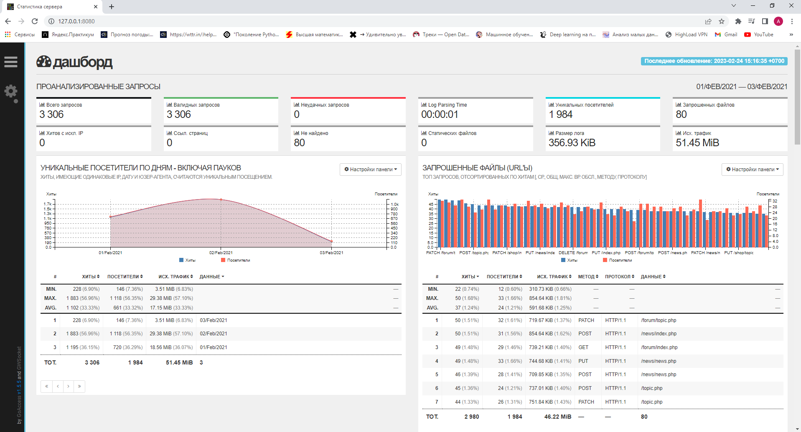

## Утилита
```
sudo apt install goaccess

```
## Веб

* Запуск `goaccess result_day* -o report.html --log-format=COMBINED --real-time-html`
* Запустить nginx c конигурацией nginx.conf
```
events {
  worker_connections 1024;
}

http {
    server {
        listen 80;
        server_name localhost;

        location / {
            root   /home/anton/school21/DO4_LinuxMonitoring_v2.0-0/src/04;
            index  report.html;
        }
    }
}
```
* Пробросить порты виртуалки

<br/> 

* Открыть веб интерфейс утилиты на локальной машине.

<br/> 