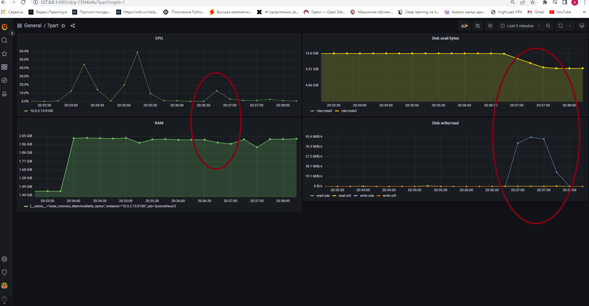
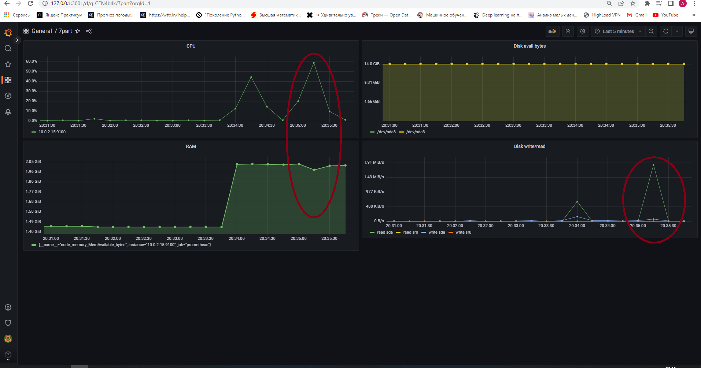

## Утилита
```
wget https://dl.grafana.com/oss/release/grafana_9.2.4_amd64.deb && sudo dpkg -i grafana_9.2.4_amd64.deb && \
sudo systemctl enable grafana-server && sudo systemctl start grafana-server

```

* Запустить ваш bash-скрипт из Части 2

Нагрузка жесткого диска (место на диске и операции чтения/записи) <br/> 

* Установить утилиту stress и запустить команду stress -c 2 -i 1 -m 1 --vm-bytes 32M -t 10s 

Нагрузка жесткого диска, оперативной памяти и ЦПУ <br/> 
