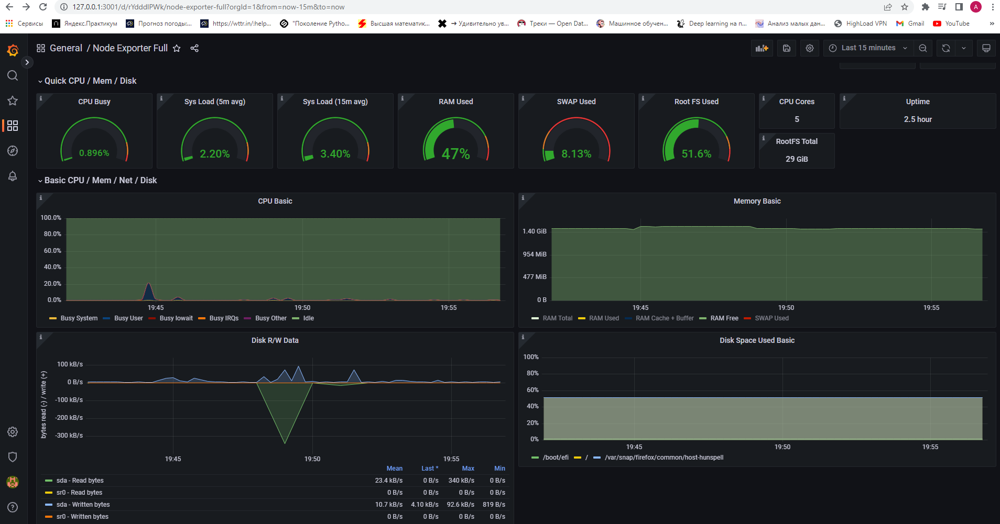
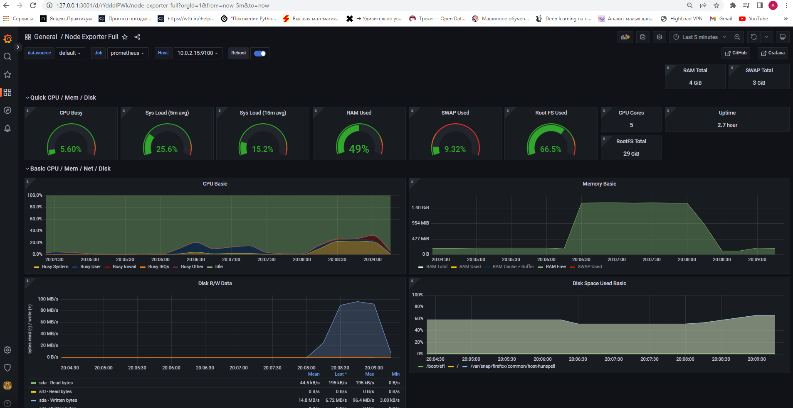
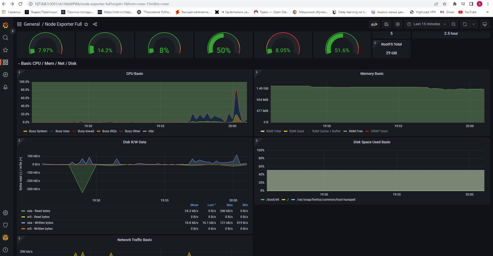

* Добавить на дашборд Grafana отображение ЦПУ, доступной оперативной памяти, свободное место и кол-во операций ввода/вывода на жестком диске

Дашборд Grafana с локальной машины   

* Запустить ваш bash-скрипт из Части 2

Нагрузка жесткого диска (место на диске и операции чтения/записи)   

* Установить утилиту stress и запустить команду stress -c 2 -i 1 -m 1 --vm-bytes 32M -t 10s 

Нагрузка жесткого диска, оперативной памяти и ЦПУ   
