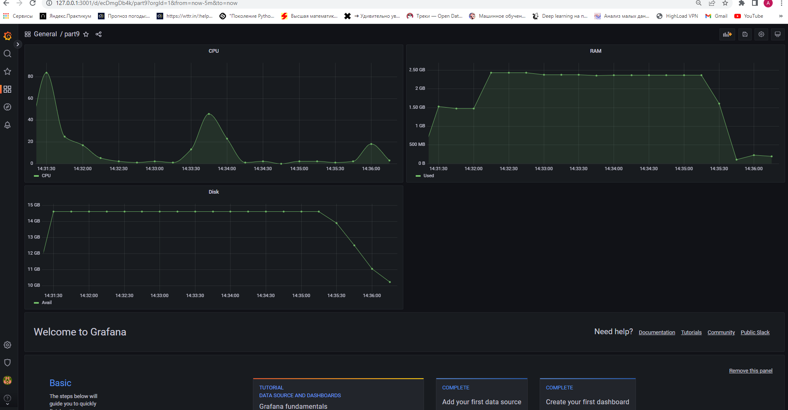
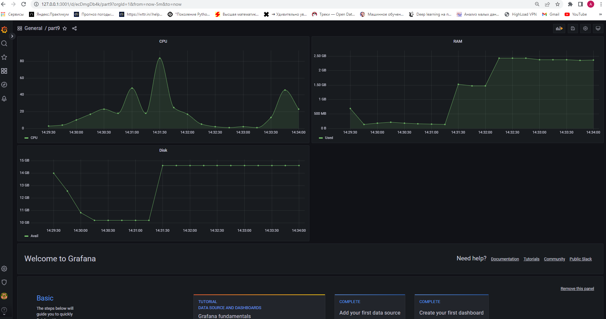

Конфиг Prometheus
```
 - job_name: bash
    static_configs:
      - targets: ['localhost:80']
```
sudo systemctl restart prometheus

Конфиг Nginx
```
http {
    server {
        listen 80;
        server_name localhost;
        location / {
            root   /home/anton/school21/DO4_LinuxMonitoring_v2.0-0/src/09;
            index  report.html;
        }
    }
}
```

* Запустить ваш bash-скрипт из Части 2

Нагрузка жесткого диска (место на диске и операции чтения/записи) <br/> 

* Установить утилиту stress и запустить команду stress -c 2 -i 1 -m 1 --vm-bytes 32M -t 10s 

Нагрузка жесткого диска, оперативной памяти и ЦПУ <br/> 
