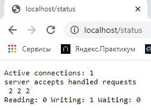

## Part 1. Готовый докер

- В отчёт поместить скрины:
  - вызова и вывода всех использованных в этой части задания команд;
  - стартовой страницы **nginx** по адресу *localhost:80* (адрес должен быть виден).

1. Взять официальный докер образ с **nginx** и выкачать его при помощи `docker pull`

Скачиваем образ <br/> 

2. Проверить наличие докер образа через `docker images`

Проверяем наличие образа <br/> 

3. Запустить докер образ через `docker run -d [image_id|repository]`

Запускаем образ <br/> 

4. Проверить, что образ запустился через `docker ps`

Проверяем запуск <br/> 

5. Посмотреть информацию о контейнере через `docker inspect [container_id|container_name]`

Смотрим информацию о контейнере <br/> 

6. По выводу команды определить и поместить в отчёт размер контейнера, список замапленных портов и ip контейнера

  * Размер образа ч/з `docker images` - 142МБ <br/> 
  * Размер контейнера ч/з `docker ps -s` - 1.09кБ <br/> 
  * Список замапленных портов <br/> 
  * ip контейнера <br/> 

7. Остановить докер образ через `docker stop [container_id|container_name]`

Останавливаем образ <br/> 

8. Проверить, что образ остановился через `docker ps`

Проверяем <br/> 

9. Запустить докер с замапленными портами 80 и 443 на локальную машину через команду *run*

Запускаем образ с портами 80, 443 <br/> 

10. Проверить, что в браузере по адресу *localhost:80* доступна стартовая страница **nginx**

Проверяем через браузер <br/> 

11. Перезапустить докер образ через `docker restart [image_id|repository]`

Перезапускаем <br/> 

12. Проверить любым способом, что контейнер запустился

Проверяем <br/> 

## Part 2. Операции с контейнером

- В отчёт поместить скрины:
  - вызова и вывода всех использованных в этой части задания команд;
  - содержимое созданного файла *nginx.conf*;
  - страницы со статусом сервера **nginx** по адресу *localhost:80/status*.

1. Прочитать конфигурационный файл *nginx.conf* внутри докер образа через команду *exec*

nginx.conf <br/> 

2. Создать на локальной машине файл *nginx.conf*

3. Настроить в нем по пути */status* отдачу страницы статуса сервера **nginx**

nginx.conf <br/> 

4. Скопировать созданный файл *nginx.conf* внутрь докер образа через команду `docker cp`

Переносим nginx.conf на образ <br/> 

5. Перезапустить **nginx** внутри докер образа через команду *exec*

Перезапускаем nginx <br/> 

6. Проверить, что по адресу *localhost:80/status* отдается страничка со статусом сервера **nginx**

Смотрим страницу статуса <br/> 

7. Экспортировать контейнер в файл *container.tar* через команду *export*

Экспортируем контейнер в tar <br/> 

8. Остановить контейнер

Останавливаем контейнер <br/> 

9. Удалить образ через `docker rmi [image_id|repository]`, не удаляя перед этим контейнеры

Удаляем контейнер <br/> 

10. Импортировать контейнер обратно через команду *import*

Импортируем контейнер <br/> 

11. Запустить импортированный контейнер

Запускаем контейнер, стартуем nginx <br/> 

Проверяем статус <br/> 

## Part 3. Мини веб-сервер

1. Написать мини сервер на **C** и **FastCgi**, который будет возвращать простейшую страничку с надписью `Hello World!`
    * [server.c](03/server.c)
2. Запустить написанный мини сервер через *spawn-cgi* на порту 8080
3. Написать свой *nginx.conf*, который будет проксировать все запросы с 81 порта на *127.0.0.1:8080*

    * [nginx.conf](03/nginx.conf)
    * [Makefile](03/Makefile)

Запускаем <br/> 

4. Проверить, что в браузере по *localhost:81* отдается написанная вами страничка

Проверяем <br/> 

5. Положить файл *nginx.conf* по пути *./nginx/nginx.conf* (это понадобиться позже)

## Part 4. Свой докер

1. Написать свой докер образ, который:
    1) собирает исходники мини сервера на FastCgi из [Части 3](#part-3-мини-веб-сервер)
    2) запускает его на 8080 порту
    3) копирует внутрь образа написанный *./nginx/nginx.conf*
    4) запускает **nginx**.

*При написании докер образа избегайте множественных вызовов команд RUN*

[Dockerfile](04/Dockerfile)

**nginx** можно установить внутрь докера самостоятельно, а можно воспользоваться готовым образом с **nginx**'ом, как базовым._

2. Собрать написанный докер образ через `docker build` при этом указав имя и тег

Собираем образ <br/> 

3. Проверить через `docker images`, что все собралось корректно

Собралось <br/> 

4. Запустить собранный докер образ с маппингом 81 порта на 80 на локальной машине и маппингом папки *./nginx* внутрь контейнера по адресу, где лежат конфигурационные файлы **nginx**'а (см. [Часть 2](#part-2-операции-с-контейнером))

Запускаем образ с мэппингом <br/> 

5. Проверить, что по localhost:80 доступна страничка написанного мини сервера

Проверяем <br/> 

6. Дописать в *./nginx/nginx.conf* проксирование странички */status*, по которой надо отдавать статус сервера **nginx**

```
        location /status {
            stub_status on;
        }
```

7. Перезапустить докер образ

*Если всё сделано верно, то, после сохранения файла и перезапуска контейнера, конфигурационный файл внутри докер образа должен обновиться самостоятельно без лишних действий*

8. Проверить, что теперь по *localhost:80/status* отдается страничка со статусом **nginx**

Проверяем <br/> 

## Part 5. **Dockle**

1. Просканировать контейнер из предыдущего задания через `dockle [container_id|container_name]`

2. Исправить контейнер так, чтобы при проверке через **dockle** не было ошибок и предупреждений

[Измененный Dockerfile](05/Dockerfile)

Исправляем <br/> 

## Part 6. Базовый **Docker Compose**

1. Написать файл *docker-compose.yml*, с помощью которого:
    1) Поднять докер контейнер из [Части 5](#part-5-инструмент-dockle) _(он должен работать в локальной сети, т.е. не нужно использовать инструкцию **EXPOSE** и мапить порты на локальную машину)_
    2) Поднять докер контейнер с **nginx**, который будет проксировать все запросы с 8080 порта на 81 порт первого контейнера
2. Замапить 8080 порт второго контейнера на 80 порт локальной машины
3. Остановить все запущенные контейнеры

* [Dockerfile server](06/server/Dockerfile)
* [docker-compose.yml](06/docker-compose.yml)

4. Собрать и запустить проект с помощью команд `docker-compose build` и `docker-compose up`

Собираем образы проекта <br/> 

Запускаем проект <br/> 

5. Проверить, что в браузере по *localhost:80* отдается написанная вами страничка, как и ранее

Проверяем <br/>  <br/> 